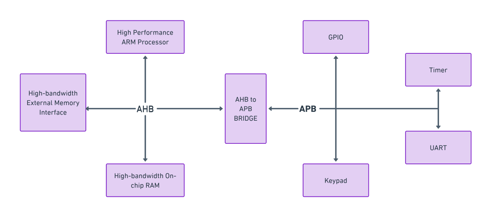
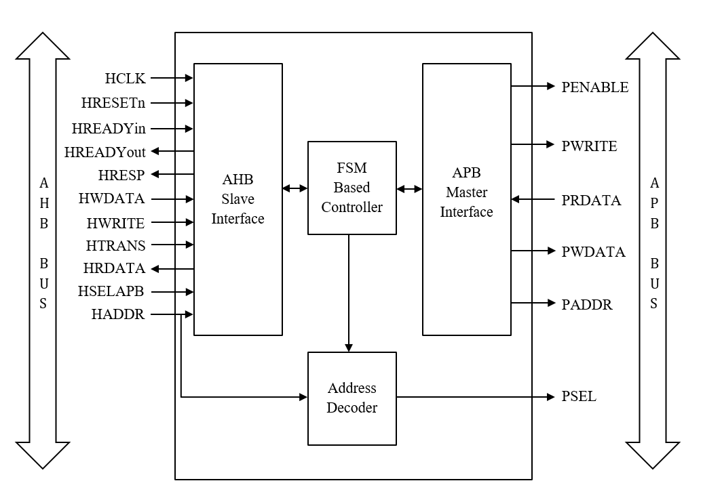
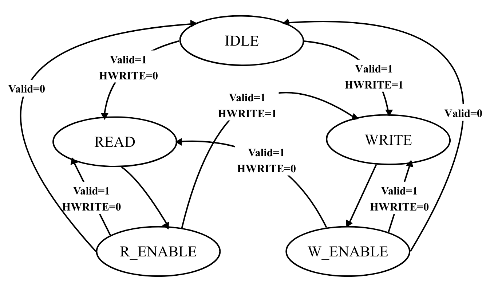
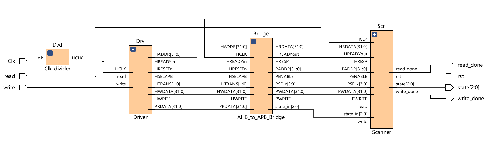
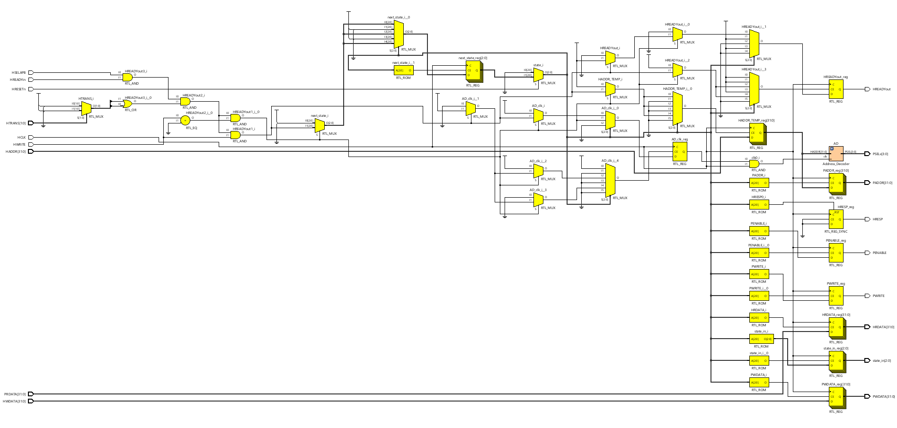
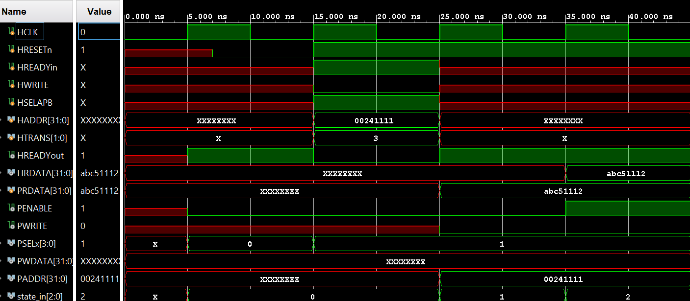
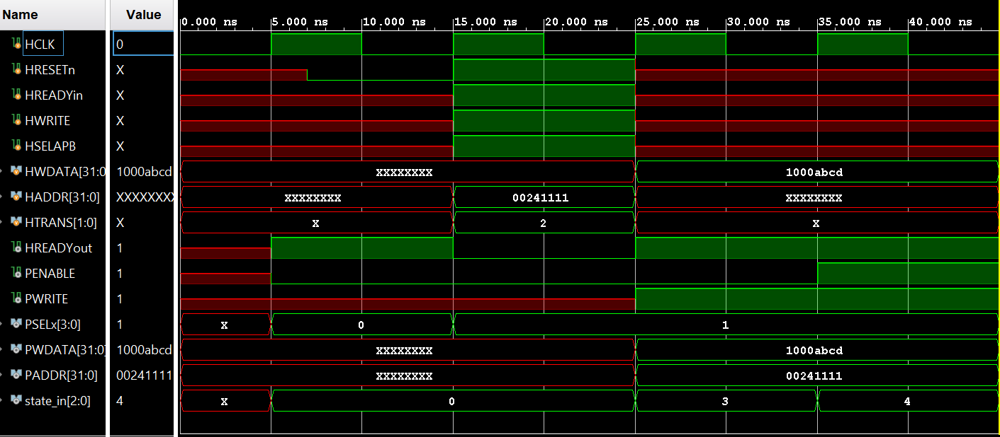
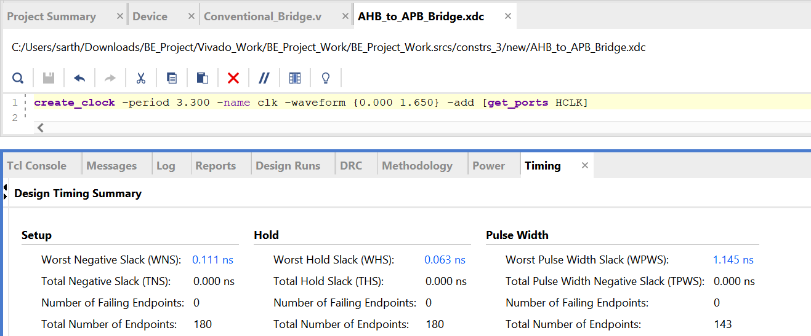
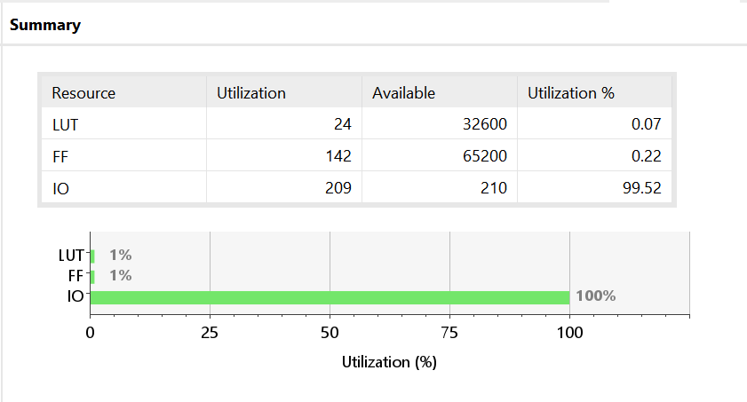
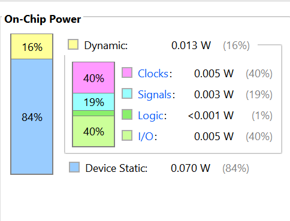

# FPGA-Based Low-Latency AHB-to-APB Bridge

*A low-latency and power-efficient AHB-to-APB bridge implemented in Verilog HDL with optimized FSM control, early address decoding, and FPGA validation on a Xilinx Spartan-7 FPGA.*

---

## Overview

Modern System-on-Chip (SoC) designs integrate high-performance processors, memory subsystems, and numerous low-speed peripherals on a single chip. While these components operate together as part of the same system, their communication requirements differ significantly. High-performance modules require high-bandwidth communication with pipelined transfers, whereas peripheral devices prioritize simplicity, deterministic timing, and low power consumption. The ARM Advanced Microcontroller Bus Architecture (AMBA) addresses these requirements by defining multiple bus protocols, each optimized for a specific class of components.

The **Advanced High-performance Bus (AHB)** is designed for processors, memory controllers, and other performance-critical modules, whereas the **Advanced Peripheral Bus (APB)** provides a lightweight interface for low-speed peripherals such as timers, GPIOs, UARTs, and communication controllers. Since these buses follow different protocols and timing mechanisms, direct communication between them is not possible. An AHB-to-APB bridge therefore acts as an essential protocol converter, translating transactions from the high-speed system bus into APB-compatible transfers while maintaining protocol correctness.

This project presents the design and implementation of a **low-latency AHB-to-APB bridge** using **Verilog HDL**. Unlike a conventional bridge, the proposed architecture incorporates **early address decoding**, an **optimized finite state machine**, **transaction overlap**, and **fine-grain clock gating** to reduce communication latency without compromising protocol compliance. The design has been simulated, synthesized, and implemented using **Xilinx Vivado**, followed by hardware validation on a **Spartan-7 FPGA**.

---

# Why This Project?

Traditional AHB-to-APB bridges generally prioritize protocol correctness over performance. Their finite state machines often introduce unnecessary idle cycles between successive transactions, increasing the overall latency of peripheral accesses. While this additional latency may appear insignificant for isolated transactions, it becomes increasingly noticeable in embedded systems where peripherals are accessed frequently.

The objective of this work was to investigate whether protocol conversion could be performed more efficiently without violating AMBA specifications. Instead of redesigning the entire communication architecture, the focus was placed on optimizing the internal operation of the bridge itself. The resulting design introduces architectural improvements that allow APB transactions to begin earlier, reduce unnecessary state transitions, and support continuous back-to-back transfers whenever possible.

In addition to improving latency, the bridge also incorporates selective clock gating to minimize unnecessary switching activity. The resulting architecture demonstrates that meaningful performance improvements can be achieved through careful control-path optimization while maintaining low hardware complexity and comparable power consumption.

---

# AMBA Architecture

The ARM **Advanced Microcontroller Bus Architecture (AMBA)** provides a standardized communication framework for connecting functional modules within a System-on-Chip. Rather than relying on proprietary interfaces between processors and peripherals, AMBA defines well-structured bus protocols that simplify system integration, improve scalability, and promote hardware reusability.

Among the various AMBA protocols, **AHB** and **APB** are widely adopted because they serve complementary purposes within an embedded system.

The **Advanced High-performance Bus (AHB)** forms the high-speed communication backbone of the SoC. It supports pipelined transfers, burst transactions, and multiple bus masters, making it suitable for processors, memory controllers, DMA engines, and other performance-critical components. By overlapping the address and data phases of consecutive transfers, AHB achieves high throughput and efficient utilization of the system bus.

The **Advanced Peripheral Bus (APB)**, in contrast, is intentionally designed as a simple, non-pipelined protocol for low-bandwidth peripherals. Devices such as UARTs, GPIO controllers, timers, watchdogs, and interrupt controllers generally do not require high-speed communication, making APB an ideal low-power interface. Every APB transaction consists of only two phases **SETUP** and **ENABLE** which simplifies peripheral design while minimizing hardware overhead.

Because AHB and APB follow different communication mechanisms, they cannot communicate directly. An AHB master issues pipelined transactions with overlapping phases, whereas APB expects a deterministic two-cycle transfer sequence. Bridging these fundamentally different protocols requires careful synchronization of address, control, and data signals while preserving the timing requirements of both buses.

The proposed bridge performs this protocol translation efficiently by behaving as an **AHB slave** on one side and an **APB master** on the other. It captures transactions initiated by the AHB master, converts them into APB-compatible operations, and returns the appropriate response once the peripheral transaction is complete.

<p align="center">
    
    <br>
    <em>Figure 1. AMBA System Hierarchy showing the relationship between AHB and APB buses.</em>
</p>

---

# Overall Architecture

The proposed bridge has been designed using a modular architecture in which each functional block performs a dedicated task within the protocol conversion process. This separation of responsibilities improves readability, simplifies verification, and allows individual modules to be modified or extended without affecting the remainder of the design.

The bridge primarily consists of four functional modules:

- **AHB Slave Interface**
- **Finite State Machine (FSM) Controller**
- **Address Decoder**
- **APB Master Interface**

The AHB Slave Interface receives transactions from the system bus and validates them before forwarding the required control information to the controller. The FSM coordinates the entire protocol conversion process by sequencing the APB SETUP and ENABLE phases while simultaneously managing AHB handshaking. The Address Decoder identifies the destination peripheral based on the incoming address and activates the corresponding APB select signal. Finally, the APB Master Interface generates protocol-compliant APB transactions and transfers data between the peripheral and the AHB domain.

Together, these modules create a bridge capable of translating transactions with reduced latency while preserving complete AMBA protocol compliance.

<p align="center">
    
    <br>
    <em>Figure 2. Block Diagram of the Proposed AHB-to-APB Bridge.</em>
</p>

---

# Working Principle

The bridge operates as an intermediary between the AHB and APB buses. Whenever the processor initiates an access to an address belonging to the APB address space, the bridge captures the transaction and temporarily behaves as an AHB slave. The incoming address, control signals, and write data are synchronized internally before being translated into an equivalent APB transaction.

Unlike conventional implementations that wait until the completion of several intermediate operations before preparing the APB interface, the proposed design performs address decoding during the AHB address phase itself. This early preparation enables the bridge to determine the target peripheral before entering the APB SETUP phase, eliminating unnecessary delays.

The protocol conversion itself is coordinated by an optimized finite state machine. During write operations, the bridge captures the address and write data from the AHB interface, generates the corresponding APB control signals, and completes the transfer within a single APB ENABLE phase. Read operations follow a similar sequence, with data being captured from the selected APB peripheral and forwarded back to the AHB master through the HRDATA bus.

Another important characteristic of the proposed architecture is its ability to support back-to-back transactions. Instead of always returning to the IDLE state after completing a transfer, the controller immediately checks whether another valid request is available. If so, it transitions directly into the next transaction, reducing idle cycles and improving overall throughput.

---

# AHB Slave Interface

The AHB Slave Interface forms the primary communication point between the bridge and the high-performance system bus. From the perspective of the processor, the bridge behaves exactly like a standard AHB slave, allowing seamless integration into any AMBA-based system without requiring modifications to the processor or bus architecture.

Its primary responsibility is to capture the address, control, and data associated with every valid AHB transaction targeting the APB address space. During the address phase, the interface monitors signals such as **HADDR**, **HTRANS**, **HWRITE**, **HSELAPB**, and **HREADYin**. Once a valid transfer is detected, these signals are registered internally to ensure stable operation throughout the protocol conversion process.

The interface also manages the AHB handshake mechanism through **HREADYout**. Whenever an APB transaction is still in progress, the bridge temporarily stalls the AHB master by de-asserting HREADYout. Once the peripheral access completes, HREADYout is asserted again, allowing the processor to continue normal operation without violating protocol timing.

---

# APB Master Interface

The APB Master Interface is responsible for generating all control signals required by the peripheral bus. Under the supervision of the finite state machine, it drives the peripheral address, write data, transfer direction, and enable signals while strictly following the APB communication protocol.

During write operations, the interface places the decoded address on **PADDR**, forwards the write data to **PWDATA**, asserts **PWRITE**, and initiates the APB SETUP phase. On the following clock cycle, **PENABLE** is asserted, completing the transfer. Read operations follow an identical sequence, except that data returned by the peripheral through **PRDATA** is captured and forwarded to the AHB master via **HRDATA**.

Since the proposed design targets peripherals with deterministic access latency, the bridge assumes fixed-cycle APB transfers and does not require the **PREADY** handshake signal. This simplifies the control logic while reducing transaction latency.

---

# Address Decoder

The Address Decoder determines which APB peripheral should respond to an incoming AHB transaction. It continuously monitors the latched AHB address and generates the appropriate peripheral select signal (**PSEL**) according to the predefined memory map.

A distinguishing feature of this implementation is the use of **early address decoding**. Instead of waiting until the APB transaction begins, decoding is performed during the AHB address phase itself. Consequently, the destination peripheral is already known before the APB SETUP phase starts, allowing the controller to prepare control signals in advance and eliminate unnecessary waiting cycles.

To further improve efficiency, the decoder incorporates **fine-grain clock gating**. Its clock remains disabled whenever no valid APB transaction is pending, preventing unnecessary switching activity and reducing dynamic power consumption without affecting functional correctness.

---

# Finite State Machine

The finite state machine is the heart of the proposed bridge, coordinating every stage of protocol conversion. It supervises the sequencing of AHB and APB operations, controls handshake signals, and determines when each transfer begins and ends. Rather than following a purely Moore or Mealy implementation, the controller combines characteristics of both approaches. Output signals remain state-dependent to preserve deterministic APB timing, while state transitions respond immediately to incoming AHB requests, improving responsiveness.

The controller consists of five operating states: **IDLE**, **READ**, **R_ENABLE**, **WRITE**, and **W_ENABLE**. The READ and WRITE states correspond to the APB SETUP phase, while the ENABLE states complete the transfer by asserting PENABLE. At the end of each transaction, the FSM evaluates whether another valid request is already available. If so, it immediately transitions into the next transfer instead of returning to the IDLE state. This simple optimization enables continuous back-to-back communication and plays a significant role in achieving the reduced transaction latency of the proposed bridge.

---

## State Transition Table

| Current State | Condition | Next State |
|---------------|-----------|------------|
| IDLE | Valid = 1 & HWRITE = 0 | READ |
| IDLE | Valid = 1 & HWRITE = 1 | WRITE |
| READ | — | R_ENABLE |
| WRITE | — | W_ENABLE |
| R_ENABLE | Valid = 1 & HWRITE = 0 | READ |
| R_ENABLE | Valid = 1 & HWRITE = 1 | WRITE |
| R_ENABLE | Valid = 0 | IDLE |
| W_ENABLE | Valid = 1 & HWRITE = 0 | READ |
| W_ENABLE | Valid = 1 & HWRITE = 1 | WRITE |
| W_ENABLE | Valid = 0 | IDLE |

<p align="center">
    
    <br>
    <em>Figure 3. Optimized Finite State Machine of the Proposed Bridge.</em>
</p>

---

# Low-Latency Design Techniques

The primary objective of this work was to reduce the communication latency between the AHB and APB buses while preserving protocol compliance and minimizing hardware overhead. Rather than introducing complex architectural modifications, the optimization focuses on improving the internal operation of the bridge through efficient control logic, intelligent signal preparation, and selective power management. The combined effect of these techniques enables the bridge to complete write transactions in **three clock cycles**, achieving a **25% reduction in latency** compared to a conventional implementation.

## Early Address Decoding

In a conventional AHB-to-APB bridge, the destination peripheral is typically identified after the AHB transaction has progressed through multiple stages. This introduces additional waiting cycles before the APB transfer can begin. To eliminate this delay, the proposed architecture performs **address decoding during the AHB address phase itself**.

As soon as a valid AHB transaction is detected, the incoming address is decoded and the corresponding peripheral select signal is prepared in advance. Consequently, when the FSM enters the APB SETUP phase, the destination peripheral has already been identified, allowing the transfer to proceed immediately without additional decoding delays. This simple optimization contributes significantly to the reduction in overall transaction latency.

---

## Transaction Overlap

One of the primary sources of latency in conventional bridge implementations is the repeated transition through the **IDLE** state after every completed transfer. Even when another valid request is already available, the controller often returns to IDLE before initiating the next transaction, resulting in unnecessary clock cycles.

The proposed FSM eliminates this inefficiency by evaluating incoming requests immediately after completing each APB ENABLE phase. Instead of always returning to the IDLE state, the controller transitions directly into the next READ or WRITE state whenever another valid transfer is pending. This allows consecutive transactions to execute seamlessly, significantly improving bus utilization and reducing idle cycles during continuous peripheral accesses.

---

## Fine-Grain Clock Gating

Although the primary objective of the project is latency reduction, power efficiency was also considered during the design process. Instead of applying clock gating to the entire bridge, a **fine-grain clock gating** approach was adopted.

The Address Decoder operates only when a valid AHB transaction targeting the APB address space is detected. During idle periods, its clock is disabled, preventing unnecessary switching activity within the decoder logic. Since only the required module is gated, the optimization reduces dynamic power consumption without introducing additional wake-up delays or affecting protocol timing. This selective approach allows the bridge to maintain power consumption comparable to a conventional implementation despite incorporating additional control logic.

---

## Datapath Optimization

The datapath has been designed to support efficient protocol conversion while minimizing hardware complexity. Address, control, and data signals are captured only when required, avoiding unnecessary register stages and redundant logic.

For write operations, the incoming AHB address is temporarily stored before initiating the APB transaction, ensuring stable address propagation throughout the transfer. Similarly, read data returned by the APB peripheral is captured at the completion of the ENABLE phase and forwarded directly to the AHB master. By carefully organizing the datapath and reducing unnecessary intermediate operations, the bridge achieves improved timing performance with only a small increase in FPGA resource utilization.

---

# FPGA Prototyping Framework

Simulation alone cannot guarantee that a digital design will behave correctly once deployed on hardware. To facilitate rapid hardware validation, an auxiliary FPGA prototyping framework was developed around the bridge. This framework provides a complete environment for generating transactions, observing responses, and verifying protocol conversion directly on the FPGA without relying on external hardware.

The framework consists of four primary modules: a **Driver**, **Clock Divider**, **Scanner**, and the **AHB-to-APB Bridge** itself. The Driver generates predefined AHB read and write transactions, while the Clock Divider derives the operating clock required by the design. The Scanner continuously monitors the bridge outputs and verifies successful completion of each transaction. Together, these modules create a self-contained verification platform capable of demonstrating the bridge functionality on the Spartan-7 FPGA.

Beyond hardware verification, the framework proved valuable during debugging and iterative development. Since every transaction could be generated and monitored directly on the FPGA, design modifications could be validated quickly without repeatedly modifying simulation testbenches. This significantly reduced development time and provided greater confidence in the correctness of the final implementation.

<p align="center">
    
    <br>
    <em>Figure 4. Auxiliary FPGA Prototyping Framework developed for hardware validation.</em>
</p>

---

# RTL Schematic

Following synthesis, Vivado generates the Register Transfer Level (RTL) schematic, providing a graphical representation of the synthesized hardware architecture. Unlike the behavioural block diagram, the RTL schematic reflects how the Verilog description has been interpreted and interconnected by the synthesis tool, allowing verification of the actual hardware implementation before placement and routing.

The generated schematic confirms the modular organization of the proposed bridge. The AHB Slave Interface, FSM Controller, Address Decoder, and APB Master Interface are clearly separated while maintaining well-defined signal connectivity between each module. This visualization also verifies that the optimized control logic, datapath organization, and protocol conversion mechanisms have been synthesized exactly as intended.

Examining the RTL schematic provides an additional level of confidence that the implemented hardware accurately represents the original design and serves as an important intermediate step before timing analysis and FPGA implementation.

<p align="center">
    
    <br>
    <em>Figure 5. RTL Schematic generated by Xilinx Vivado after synthesis.</em>
</p>

---

# Simulation

The functional correctness of the proposed bridge was verified through behavioral simulation using **Xilinx Vivado Simulator**. Separate test cases were developed for both read and write transactions to ensure that the bridge correctly translated AHB transactions into protocol-compliant APB transfers while maintaining proper synchronization between the two buses.

The simulation waveforms validate the operation of the optimized FSM, correct generation of handshake signals, successful protocol conversion, and accurate transfer of address and data between the AHB and APB interfaces.

---

## Read Transaction

During a read operation, the AHB master initiates a valid transfer by placing the target peripheral address on the AHB bus while asserting the appropriate control signals. Once the bridge recognizes a valid read request, the FSM transitions from the **IDLE** state to the **READ** state, corresponding to the APB SETUP phase.

The destination peripheral address is placed on the APB bus, while **PWRITE** remains de-asserted to indicate a read operation. In the following clock cycle, the FSM enters the **R_ENABLE** state by asserting **PENABLE**, allowing the selected peripheral to drive the requested data onto the **PRDATA** bus. The bridge captures this data and forwards it to the AHB master through **HRDATA**, completing the transaction successfully in **three clock cycles**.

The waveform verifies correct sequencing of AHB and APB control signals, proper synchronization between both protocols, and successful transfer of data from the peripheral to the processor.

<p align="center">
    
    <br>
    <em>Figure 6. Simulation waveform showing the APB read transaction.</em>
</p>

---

## Write Transaction

For a write operation, the AHB master provides both the destination address and write data along with the corresponding control signals. After validating the transaction, the bridge temporarily stores the address and write data before initiating the APB transfer.

The FSM first enters the **WRITE** state, where the APB address, write data, and control signals are prepared during the SETUP phase. On the following clock cycle, the controller transitions to the **W_ENABLE** state by asserting **PENABLE**, allowing the peripheral to accept the incoming data.

Unlike conventional AHB-to-APB bridges that require four clock cycles to complete a write transaction, the optimized controller eliminates an unnecessary idle cycle by combining early address preparation with efficient state transitions. As a result, the write operation is completed in **three clock cycles**, demonstrating the primary contribution of this work.

<p align="center">
    
    <br>
    <em>Figure 7. Simulation waveform showing the optimized write transaction.</em>
</p>

---

# FPGA Implementation

Following successful simulation, the complete design was synthesized and implemented using **Xilinx Vivado Design Suite** targeting the **Xilinx Spartan-7 FPGA** available on the Boolean Development Board. The implementation flow consisted of RTL synthesis, design optimization, placement, routing, timing verification, and bitstream generation before hardware validation.

The successful implementation demonstrates that the proposed bridge is fully synthesizable and suitable for practical FPGA-based embedded systems. Hardware verification further confirmed that the observed behavior matched the simulation results, validating both the functionality and correctness of the proposed architecture.

---

# Timing Analysis

Timing analysis was performed after implementation to evaluate the maximum operating frequency and verify that all timing constraints were successfully satisfied. The optimized control path introduced by the proposed architecture shortens the critical path, allowing the bridge to operate at a higher clock frequency than a conventional implementation.

The generated timing report confirms that the design meets all setup and hold timing requirements without any violations. The bridge supports operation at a minimum clock period of **3.3 ns**, corresponding to a maximum operating frequency of approximately **300 MHz**, demonstrating the effectiveness of the proposed latency-aware optimizations.

<p align="center">
    
    <br>
    <em>Figure 8. Timing analysis report generated by Xilinx Vivado.</em>
</p>

---

# FPGA Resource Utilization

Resource utilization was analyzed after synthesis to evaluate the hardware overhead introduced by the proposed optimizations. The implementation requires only a modest increase in logic resources compared to a conventional bridge, primarily due to the additional control logic required for the optimized FSM, early address decoding, and temporary storage registers.

Although the optimized architecture consumes slightly more LUTs and registers, the increase is relatively small considering the achieved reduction in communication latency. The results demonstrate that meaningful performance improvements can be obtained with only minimal additional hardware resources, making the design suitable for resource-constrained FPGA platforms.

<p align="center">
    
    <br>
    <em>Figure 9. FPGA resource utilization after synthesis.</em>
</p>

---

# Power Analysis

Power estimation was performed using the Vivado Power Analyzer after implementation. Despite introducing additional control logic, the proposed bridge exhibits power consumption comparable to a conventional implementation.

This is primarily achieved through the use of **fine-grain clock gating** within the Address Decoder. By disabling unnecessary switching activity during idle periods, the additional logic required for latency optimization is effectively compensated. Consequently, both static and dynamic power remain nearly unchanged while the bridge delivers improved performance and reduced communication latency.

<p align="center">
    
    <br>
    <em>Figure 10. Power analysis report generated after implementation.</em>
</p>

---

# Repository Structure

The repository is organized to separate RTL source files, simulation files, implementation constraints, and supporting documentation. This structure simplifies project navigation and allows each stage of the FPGA design flow to be accessed independently.

```text
AHB-to-APB-Bridge/
│
├── Design Sources/
├── Simulation Sources/
├── Constraints/
│
├── Images/
│   ├── AMBA_Hierarchy.png
│   ├── Bridge_Architecture.png
│   ├── Optimized_FSM.png
│   ├── AHB_Phase.png
│   ├── APB_Phase.png
│   ├── Read_Transfer.png
│   ├── Write_Transfer.png
│   ├── Bridge_RTL_Schematic.png
│   ├── FPGA_Framework.png
│   ├── Timing.png
│   ├── Utilization.png
│   └── Power.png
│
└── README.md
```

---

# How to Run

The project has been developed using **Xilinx Vivado Design Suite** and can be reproduced by following the standard FPGA design flow.

1. Clone this repository or download the project files.
2. Create a new Vivado RTL project targeting the **Spartan-7 FPGA**.
3. Add all files from the **Design Sources** directory.
4. Add the simulation files from the **Simulation Sources** directory.
5. Import the constraint file from the **Constraints** directory.
6. Run **Behavioral Simulation** to verify functionality.
7. Execute **Synthesis**, followed by **Implementation**.
8. Generate the bitstream and program the FPGA for hardware verification.

---

# Future Improvements

Although the proposed bridge successfully reduces transaction latency while maintaining protocol compliance, several enhancements can further extend its capabilities. Future work may include support for burst transfers, integration of the **PREADY** handshake for variable-latency peripherals, configurable address mapping for multiple APB slaves, and migration to more advanced AMBA protocols such as **AXI-to-APB** conversion.

Additional verification using **SystemVerilog**, **UVM**, and formal verification techniques can further improve design robustness and facilitate integration into larger System-on-Chip environments.

---

# Author

**Sarthak Chor**

Bachelor of Engineering  
Electronics and Telecommunication Engineering  
Pune Institute of Computer Technology (PICT), Pune

**Areas of Interest**

- RTL Design
- Digital VLSI
- FPGA Design
- Computer Architecture
- System-on-Chip (SoC) Design
- AMBA Bus Protocols

---

## License

This project is intended for educational and research purposes. Feel free to use, modify, and extend the design with appropriate attribution.
